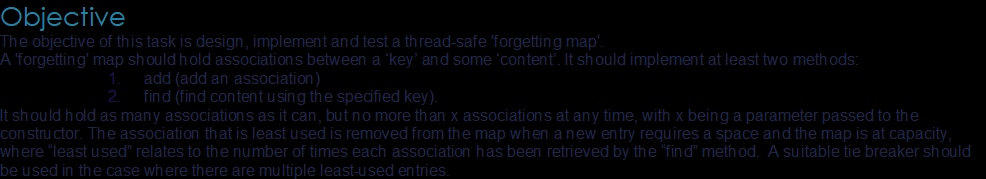

#Classes

1.ForgettingCollection - public interface that provided functions 
signature for 'ForgettingMap' and 'ForgettingList'.

2.ForgettingMap- Uses Hashmap to store Associations, with corresponding String key

3.ForgettingList- Uses ArrayList to store Association.

4.AssociationMapComparator- Comparator for ordering ForgettingMap associations
by int attribute values, or in this case number of uses.

5.Association - Object used to store contents